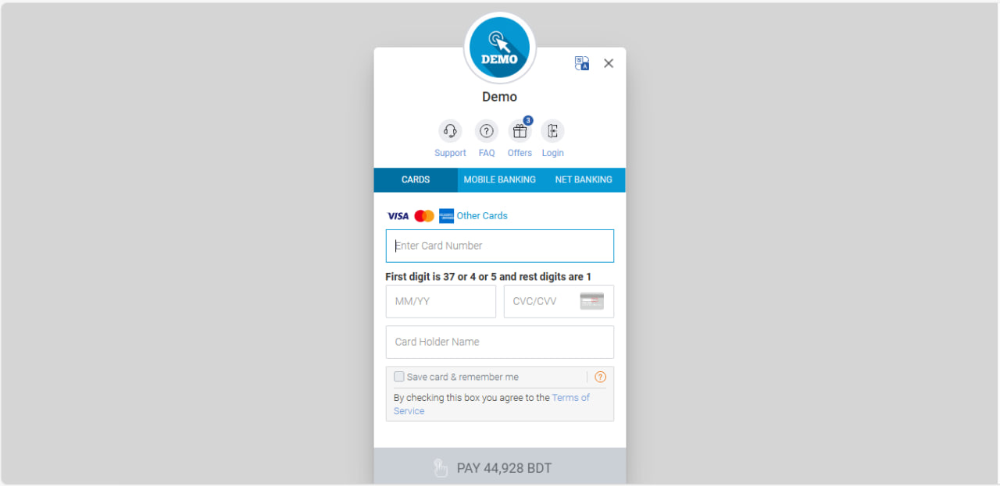

# Django Mart

Django_Mart is a user-friendly e-commerce platform designed to help people buy products efficiently and seamlessly. Built with Django and HTML, django_mart provides essential features like user sign-up, login, logout, and profile management. It offers a smooth shopping experience with an integrated cart, ordering system, and secure payment options. Users can also easily contact support for any assistance. 

## Features

### User Features
- **User sign-up:** Allows new users to create an account.
- **User login and logout:** Secure access to user accounts with the option to log out.
- **Shopping cart management:** Users can add, remove, and view products in their cart.
- **User profile management:** Users can view their orders.
- **Product ordering system:** Seamless ordering process for purchasing products.
- **Secure payment options:** Multiple secure payment methods for transactions.
- **Contact support:** Users can reach out for assistance or inquiries.

### Admin Features
- **Admin login:** Secure access for administrators to manage the platform.
- **Product inventory management:** Administrators can add, edit, and remove products from the inventory.
- **User management:** Admins can view and manage user accounts.
- **Order management:** Manage customer orders efficiently.
- **Contacts management:** Handle customer inquiries and support requests.

## How It Works

### For User

**Run the code** 

Create a new terminal. Type "cd ecommerce". Activate the virtual environment. Then run "python manage.py runserver".

**User Sign-Up** 

New users begin by creating an account through the sign-up feature, providing necessary information to register.

**User Login and Logout**

Once registered, users can log in securely to access their accounts. They can log out when they finish their session for enhanced security.

**Shopping Cart Management** 

After logging in, users can browse products and add items to their shopping cart. They can view, remove, or adjust the quantity of products in their cart at any time.

**Product Ordering System** 

When ready to purchase, users proceed to the checkout, where they can review their order and confirm their addresses.

**Secure Payment Options** 

Users can order using secure cards payment method to complete their transactions, ensuring a safe shopping experience.

**User Profile Management** 

Users can view their profile and previous orders, making it easy to reference past purchases.

**Contact Support** 

If users have questions or need assistance during any step, they can easily reach out to customer support for help.

### For admin

**Admin login** 

Provides secure access for administrators to manage the platform and maintain control.

**Product management** 

Allows admins to add new products, edit existing product details, and remove discontinued items from the inventory.

**User management**

Enables admins to view, edit, and deactivate user accounts as necessary to maintain a healthy user base.

**Order management** 

Facilitates efficient tracking and management of customer orders, including order status updates and order history.

**Contacts management** 

Empowers admins to handle customer inquiries and support requests, ensuring prompt responses to user needs.

## Build Manual
### Prerequisites

- **Python** (version 3.8.6)
- **Django** (version 4.2.16)
- **Requests** (version 2.22.0)
- **Pillow** (version 10.4.0)
- **SSLCommerz** (version 0.0.7)
- **six** (version 1.13.0) 
- **pip** (version 24.3.1)
- **Other packages:** (Though these are included in above packages.)
  - **certifi** (version 2019.11.28)
  - **chardet** (version 3.0.4)
  - **idna** (version 2.8)
  - **isort** (version 4.3.21)
  - **lazy-object-proxy** (version 1.4.3)
  - **mccabe** (version 0.6.1)
  - **setuptools** (version 49.2.1)
  - **sqlparse** (version 0.5.1)
  - **typed-ast** (version 1.4.0)
  - **typing_extensions** (version 4.12.2)
  - **tzdata** (version 2024.2)
  - **urllib3** (version 1.25.7)
  - **wrapt** (version 1.11.2)
